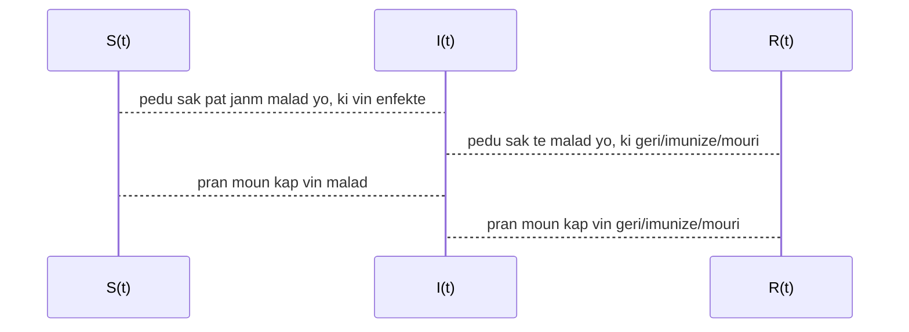

# Koub Enfeksyon nan model SIR yo

> Se pa tout sa nou ka **konte** ki *konte*, e sa pa tout sa ki *konte* ke nou ka **konte**.
>
> -- William Bruce Cameron (1963) *"Informal Sociology: A Casual Introduction to Sociological Thinking"*

Depi komansman kriz [pandemik ki lye ak virus COVID-19](https://www.arcgis.com/apps/opsdashboard/index.html#/bda7594740fd40299423467b48e9ecf6) lan, gen anpil konsey ke pesonel medikal ak sante publik yo bay ki mansyone lide "plat koub la".  Koub sila a, de manye konseptyel, se solisyon yon ekwasyon diferansyel ki se reprezantasyon matematik yon fanmi de model epidemyolojik ki rele SIR.   

Jodi a nan **An Nou Pale Syans**, nou pral eseye entrodui ak konprann kek aspe nan fondman matematik model sa yo.  Nap we kisa koub la modelize , epi ki kote li soti.  Le fini nap fe yon ti rale sou istwa model sa yo, apre sa fe yon ti pase sou divesite natu matematik yo.  Pandan nap fe tout sa, li enpotan pou nou montre limit model sa yo, san nou pa retire sou pouki yo enpotan.

Anvan nou koumanse li enpotan pou mwen eksplike kisa matematik ye pou mwen. Matematik se yon okazyon pou nou konvese.  Se pa yon dogm.  Se vre ke konvesasyon an gen anpil strikti, ki paret tre rijid.  Men se yon konvesayon li ye kanmenm, e rijidite a ede konvesasyon an koumanse; se pa yon babouket.  Apre konvesasyon an anklannche, pi bel kote li ka ale yo, se rout ki koumanse pa retire enpe lan restriksyon yo.  Egal mwen ta vle nou li sa map ekri yo kom yon envitasyon, pou nou reflechi ansanm, ak matematik, ak enfomasyon, e lot done numerik.

## Lide de baz model SIR yo
#### Poukisa nou itilize yon model

Anvan nou pale de lide de baz model SIR yo, an nou etabli poukisa nou ka enterese nan model matematik sa yo.  An jeneral, yon model se yon reprezantasyon yon reyalite.  Pa egzanp, yon achitek ka fe pou yon kliyan, yon model de batiman ke kliyan te mande konpani konstriksyon an fe.  Model lan pemet:

- kliyan an gen yon ase bon reprezantasyon vizyel de batiman an;
- kliyan an diskite ak konpani an sou seten aspe de batiman; 
- kliyan konprann kijan de bagay li vle ajoute oswa retire lan plan kay lan pou li pa afekte konstriksyon an;

tout sa anvan okenn beton koule.  Li enpotan pou nou remake ke model ke achitek la fe a, pa pran an konsiderasyon seten bagay ki pa nesese, tankou bri lan lari toupre batiman an, ou byen jan van vante kote batiman an ap ye a.  Nou remake tou ke sa pa deranje diskisyon yo, ke model lan de lwen pi piti ke vre batiman an.  Toutfwa, fok nou soulve tou ke model achitek lan, maket la, pa ka enfome ou rasure kliyan an sou rezistans parasismik ou siklonik batiman an.  Gen de aspe ki enpotan de sistem wap modelize a ke model lan inyore, pou ka konprann de lot aspe de sistem lan.

> Sonje ke tout model erone, kesyon pratik lan se, ki kantite erone fo yo erone pou yo sispann itil.
>
> -- George Box (1987) *"Empirical Model-Building and Response Surface"*

Jounal Ameriken New York Times lan, fe yon tre bon [travay pou konte ka enfeksyon COVID-19](https://github.com/nytimes/covid-19-data/tree/master) yo, e dese ki lye a ka sa yo, nan chak eta, depi koumansman epidemi a o Zetazuni.  Nan figu ki swiv yo, men fe yon graf, pou 4 eta diferan, de enfeksyon (kom pousantaj populasyon eta a) e de dese pa rapo a a kile yo rive.

| premye eta afekte  | lot kote           |
| ------------------ | ------------------ |
|  |  |
|  |  |

Nou ke we pa egzanp (an ble) ke apepre 0.5% populasyon eta New York lan te repote enfeksyon an nan debu Avril, e ke nan Wisconsin (kote mwen rete a), plis ke 35 moun te peri de maladi a (an oranj).  

Se de koub ble (pousantaj ki enfekte) a ke moun ap pale le yo pale de *plat koub lan*.  Men done yo ban nou selman yon pati de koub lan.  Nou ta renmen ka gen yon lide de res koub lan.   Sepandan nou paka annik tann ke done yo rive, paske nou bezwen koub yo pou enfomen de desizyon.  Egal nou ta renmen ka konprann kijan koub sa yo evolye, e analize evolisyon sa yo sou diferan paramet.  Se egzakteman sa nou ka koumanse fe ak model SIR yo.

#### Lide de baz lan

Model SIR la, se yon model Byoloji Matematik, ki plase presizeman nan epidemyoloji matematik.  [Epidemyoloji](https://en.wikipedia.org/wiki/Epidemiology) se pati lasyans ki etudye ak analize, ki moun, ki le, ki kote, epi kisa ki detemine kouman yon maladi evolye nan yon popilasyon.  Epidemyolojis yo bay maladi de non diferan, depandamman de kantite moun yo panse li afekte, e de kouman li rete nan yon populasyon:

- **Andemi:** se yon maladi ki ka rete nan yon ti pati lan populasyon an;
- **Epidemi:** se yon maladi ki afekte yon paket moun;
- **Pandemi:** se yon maladi ki afekte tout moun sou late.

Epidemi ki lye a [COVID-19 lan se yon pandemi](https://en.wikipedia.org/wiki/2019%E2%80%9320_coronavirus_pandemic).

Lan epidemyoloji matematik, pratik la se ke ou utilize de konsep matematik (ekwasyon diferansyel, prosesus stokastik) pou modelize de dinamik  de populasyon a echel makroskopik; pa egzanp kijan yon maladi ki kontajye propaje.

Pou yo fe sa, yo imajine ke popilasyon an pataje an 3 group: 

- moun ki poko janm malad yo, $S(t)$ (an angle *susceptible*), le tan an rive $t$;
- moun ki gen maladi a, $I(t)$ sa vle di ki enfekte (an angle *infected*), le tan an rive $t$;
- epi moun nou pa bezwen konsidere anko lan sistem lan $R(t)$ (an angle *removed*), le tan an rive $t$.

Donk chak fonksyon sa yo di nou konbyen moun ki nan chak group le nou a tan $t$.  Lide prensipal se ke li posib pou nou **dekri chanjman lan chak group sa yo si nou annik itilize 3 group sa yo**:  

- chanjman lan group moun ki pat janm enfekte yo $S$, se pousantaj lan yo ki vin enfekte;
- chanjman lan group moun ki geri/iminize/mouri $R$, se pousantaj lan moun ki te enfekte yo ki geri/iminize/mouri ;
- chanjman lan group moun ki enfekte yo $I$, se diferans de lot chanjman yo.

Lide chanjman an nan matematik, sitou nan yon branch matematik ki rele analiz, se yon lide ki tre devlope e tre nuanse.  Yon vesyon de li se yon konsep ki rele derivasyon.  Derivasyon se yon operasyon matematik ki fet sou fonksyon.  Chanjman nou sot dekri yo, nou ka itilize yo pou nou ekri de [**ekwasyon diferansyel**](https://en.wikipedia.org/wiki/Differential_equation), i.e. de ekwasyon kote varyab la se yon fonksyon.  Solisyon se donk yon fonksyon, ou nan ka pa nou a 3 fonksyon, $\{S(t), I(t), R(t)\}$.  

### Yon ti-Model Analitik, pou entrodwi $\tau$ ak $r_0$

An nou koumanse tou piti.  Ekwasyon Diferansyel ou jan rekalsitran, egal yo pa toujou ka rezoud *alamen*.  Gen yon model ki **sanble** model SIR ke nou ka rezoud *alamen*, si ou gen eksperyans ak ekwasyon diferansyel.  Model lan se yon model pou desentegrasyon radyoaktif 2 patikul, men nou pral adapte li pou nou kom aproksimasyon senp model SIR yo:
$$
\begin{align}
s'(t) &= -\frac{r_0}{\tau}s(t)\\
i'(t) &=  \frac{r_0}{\tau}s(t) - \frac{1}{\tau} i(t)\\
r'(t) &= \frac{1}{\tau} i(t)
\end{align}
$$

- $\tau$: se yon paramet epidemyolojik ki depann de maladi a; se tan mwayen pou yon moun ki enfekte vin geri/iminize/mouri.  Pou COVID-19 se apepre [14 jou](https://annals.org/aim/fullarticle/2762808/incubation-period-coronavirus-disease-2019-covid-19-from-publicly-reported).
- [$r_0$](https://wwwnc.cdc.gov/eid/article/25/1/17-1901_article): se yon lot paramet epidemyolojik, ki mezire nivo kontajyon li.  Paramet sa depann de maladi a, men li depann tou de dispozisyon sante publik ki mete an plas.  Plis li eleve, plis maladi a kontajye.  Men mezi sanite tankou *distansyasyon sosyal*, *lave men*, *miz an karanten*, diminye $r_0$.  Pou COVID-19 $r_0$ ant [1.5 e 3.5](https://labblog.uofmhealth.org/rounds/how-scientists-quantify-intensity-of-an-outbreak-like-covid-19), ou byen petet ant 1.4 e 3.9.

Men yon ti tablo ([mwen kopye done sa yo de wikipedia](https://en.wikipedia.org/wiki/Basic_reproduction_number)) pou ba ou yon lide de $r_0$ pou de lot maladi kontajye:

| maladi | $r_0$   |
| ------ | :-------: |
| [roujol](https://en.wikipedia.org/wiki/Measles) | 12 a 18 |
| [varisel](https://en.wikipedia.org/wiki/Chickenpox)| 10 a 12 |
|[rubeyol](https://en.wikipedia.org/wiki/Rubella)| 5 a 7|
|[oreyon](https://en.wikipedia.org/wiki/Mumps)| 5 a 7|
|[varyol](https://en.wikipedia.org/wiki/Smallpox)|3.5 a 6|
|[SARS](https://en.wikipedia.org/wiki/Severe_acute_respiratory_syndrome)| 2 a 5|
|[rum](https://en.wikipedia.org/wiki/Common_cold)| 2 a 3|
|[COVID-19](https://en.wikipedia.org/wiki/Coronavirus_disease_2019)| 1.4 a 3.9|
|[grip](https://en.wikipedia.org/wiki/Influenza)| 0.9 a 2.1|

Solisyon model sila ban nou premye vesyon **koub** enfekte yo:
$$
i(t) = \displaystyle \frac{r_0}{r_0-1}\left(e^{-t/\tau} - e^{-r_0t/\tau}\right),
$$
Fonksyon $i(t)$ a di ou ki pousantaj moun model la di ki enfekte pou chak vale $t$ ke ou founi.  Li enpotan pou nou remake, ke le koub lan monte preske 0.6, sa vle di ke **model lan predi** ke jou sila, 60% populasyon an ap enfekte.  Jou sa a, se jou pik maladi a.  Nou pral we tout suit kijan $r_0$ afekte pousantaj pik sila.  Men anvan nou rive sou sa, men vle su ke nou konprann ke model lan pa di ke se selman 60% moun kap enfekte.  O fet, pousantaj kumulatif de moun ki enfekte yo (pou model sa a), se fonksyon sa a ki bay li:
$$
pke(t) = \frac{r_0\tau}{r_0-1}\left(\frac{1}{r_0}e^{-r_0t/\tau} - e^{-t/\tau}\right).
$$

| $r_0=3.5$                      | $r_0=1.5$                      |
| ------------------------------ | ------------------------------ |
|  |  |

Nou itilize yon ti kalkil pou nou etidye fonksyon $i( t )$ a:
$$
i'(t)=0, \quad \textrm{le} \quad t^* = \frac{\tau \ln{r_0}}{r_0-1}
\\ \textrm{donk}\\
i_{max} = i(t^*) = \frac{r_0}{r_0-1}\left[\left(\frac{1}{r_0}\right)^{\frac{1}{r_0-1}} - 
\left(\frac{1}{r_0}\right)^{\frac{r_0}{r_0-1}}\right].
$$

| Maksimom enfekte an fonksyon de $r$                          |
| ------------------------------------------------------------ |
|  |

Nou ka **plat koub la** si nou pran mezi tankou distans sosyal, ki gen kom konsekans reduyi $r_0$, ki li menm reduyi pik enfekte yo.  Rezon fondamantal pesonel medikal ak sante publik yo mande nou  ede yo plat koub enfeksyon an, se paske:

1. Mwens moun malad, vle di mwens moun ki pa peri de maladi a.
2. Lan tout peyi, pesonel medikal la gen yon kapasite maksimal, si tout lopital yo plen ak moun ki malad a koz COVID-19, lopital sa yo paka fe anyen dot;
3. Moun ki pi ekspoze lan yon kriz sanite, se pesonel medikal yo.  Nan kad yon maladi kontajye, nou dwe fe tout posib nou pou nou minimize risk ke yo vin malad.  Plis pesonel sante publik lan afekte pa epidemi a, mwens populasyon a ka goumen kont epidemi.

## Model SIR Standar lan

> Tout bagay dwe osi senp ke posib, men pa pi senp ke sa
>
> -- Albert Einstein (atribuye 1962) *TIME Magazine*

Koulye a ke nou gen yon lide de sa koub la ye, e sa li vle di, nou ka al pi lwen ke ti model aproksimatif ke nou sot we a.  Ti model nou a te **tro senp**.  Pi gro defo li genyen se ke li sigjere ke chanjman lan moun ki poko gen maladi a, pa depann de nivo enfeksyon an nan populasyon an.  Men ou pa bezwen se yon dokte pou konprann ke plis ou an kontak ak moun ki gen yon maladi kontajye, plis ou gen chans vin enfekte.  An nou al cheche yon modelizasyon ki pi fidel a la reyalite.

#### Istwa Modelizasyon Epidemi

Modelizasyon matematik de epidemi gen yon ti istwa ase long.  Depi an 1760, yon matematisyen Suyis, [Daniel Bernoulli](https://en.wikipedia.org/wiki/Daniel_Bernoulli), te itilize modelizasyon yo, pou li konprann merit vaksinasyon nan kad motalite ki lye ak epidemi varyol.  

Youn lan premye model matematik pou epidemi, se te yon model ke statistisyen [Lowell Reed](https://en.wikipedia.org/wiki/Lowell_Reed) ak epidemyologis [Wade Hampton Frost](https://en.wikipedia.org/wiki/Wade_Hampton_Frost) te propoze an 1928 nan de klas yo tap anseye Johns Hopkins University.  Model sa te baze sou de konsep matematik ke nou jwenn nan probabilite ke yo rele de [**prosesus stokastik**](https://en.wikipedia.org/wiki/Stochastic_process), presizeman Reed ak Frost fomile model yo a an te ke yon prosesis stokastik ki rele yon [chen Markov](https://en.wikipedia.org/wiki/Markov_chain).  Model [Reed-Frost](https://en.wikipedia.org/wiki/Reed-Frost_model) lan pati de lide de baz lan, separe popilasyon an group $\{S(t), I(t), R(t)\}$, men koulye a pa egzanp, model la pa di ou egzakteman konbyen moun kap enfekte $I(t)$ a $t$, men li di ou de preferans probabilite ke kantite moun lan se $0, 1, 2, 3 , 4 \ldots$, $p_0, p_1, p_2, p_3, p_4, \ldots$; le fet ke prosesus lan se yon chen Markov presize ke pa egzanp $p_k$ se yon fonksyon de $S(t-1), I(t-1), R(t-1)$.   A nou di ke $q$ se probabilite pou pa pran maladi a le ou kontre ak yon moun ki enfekte,  an probabilite nou ekri model Reed-Frost lan:
$$
\mathbb{P}\left\{I(t) = k | S(t-1), I(t-1), R(t-1)\right\} = {S(t-1) \choose k} \left(1-q^{I(t-1)}\right)^{k}\left(q^{I(t-1)}\right)^{S(t-1)-k},
$$
nou di ke $I(t)$ gen yon [distribusyon binomyal](https://en.wikipedia.org/wiki/Binomial_distribution) $\displaystyle BIN\left(S(t-1), 1-q^{I(t-1)}\right)$.

Model sila enteresan paske li pi fidel a vre dinamik yon epidemi.  Chak moun ki gen maladi a, le yo pre yon moun ki poko janm gen maladi a, yo gen yon chans pou yo enfekte moun sila.  Plis enteraksyon long, plis yo te pre, plis moun malad la touse, plis chans lan monte ve yon setitud; men se kanmenm yon chans.  Model ki baze sou ekwasyon diferansyel yo, model **deteminis** yo, rezime enfomasyon sila, e dufet pedi lan fidelite yo.  Men sa model Reed-Frost akeri lan fidelite li peye li ak difikilte.  An jeneral an matematik, li pi difisil pou konprann yon model deteminis, ke yon model **stokastik**; donk malgre model stokastik lan gendwa [pi rich e subtil](http://user.math.uzh.ch/barbour/pub/Barbour/BMollison.pdf), ou gen tandans konprann e dekouvri plus nuans avek model deteminis yo.

#### Model SIR Standar lan

Donk model epidemyoloji SIR standar lan se yon model ke biochimis [Kermack](https://en.wikipedia.org/wiki/William_Ogilvy_Kermack) ak epidemyologis [McKendrick](https://en.wikipedia.org/wiki/Anderson_Gray_McKendrick) entroduyi an 1927.  Se yon model ekwasyon diferansyel, donk deteminis.  Li pati de lide de baz lan, men kontreman a model desentegrasyon 2 patikul radyoaktif lan, li entrodui ke chanjman lan moun ki poko gen maladi a, **depann** de nivo enfeksyon an nan populasyon an.  Ekwasyon diferansyel lan se:
$$
\begin{align}
S'(t) &= -\frac{r_0}{\tau}I(t)S(t)\\
I'(t) &=  \frac{r_0}{\tau}I(t)S(t) - \frac{1}{\tau} I(t)\\
R'(t) &= \frac{1}{\tau} I(t)
\end{align}
$$
Jan nou te di lan koumansman an, ekwasyon diferansyel yo rekalsitran, egal nou paka rezoud ekwasyon sila *alamen*.  Presizeman, ekwasyon sila rekalsitran paske li pa lineye, kontreman a ekwasyon radyoaktivite nou a.  Le yon ekwasyon diferansyel lineye, nou ka utilize struktu aljebrik sila pou nou rezoud li *alamen*.  Domajman, model Kermack-McKendrick lan non-lineye.  

Toufwa, nou ka itilize yon lot aproch.  Nou itilize yon aproch **numerik**, kote nou itilize yon algoritm ke nou programe yon odinate pou egzekite li.  Teknik numerik nou utilize pou nou jwenn solusyon model Kermack-McKendrick lan se yon algorithm ki rele [metod Runge-Kutta](https://en.wikipedia.org/wiki/Runge-Kutta_methods) ke 2 matematisyen Alman [Runge](https://en.wikipedia.org/wiki/Carl_David_Tolm%C3%A9_Runge) ak [Kutta](https://en.wikipedia.org/wiki/Martin_Kutta) devlope nan debu 20tyem syek lan.

Youn lan premye bagay mwen vle chita sou li, se ke, solisyon ekwasyon Kermack-McKendrick yo pa menm ak solusyon model radyoaktivite yo:

| $\tau = 14, R_0 = 3.5$   | $\tau = 14, R_0 = 1.5$   |
| ------------------------ | ------------------------ |
|  |  |
|  |  |

- Tou 2 montre tandans kwasans rapid lan le gen ankenn mezi sante piblik ki pran, sepandan model radyoaktivite a montre ke jiska 60% de popilasyon an enfekte aloske model SIR ki pi fidel lan montre pik enfeksyon an rive mwens ke 40%.
- Pi enpotan toujou, model SIR montre efikasite potansyel mezi sante publik yo, lan jan koub plat lan chanje.

| Model SIR Kermack-McKendrick: Plat Koub La! |
| ------------------------------------------- |
|                       |

Mwen ta vle chita sou 2 bagay anvan nou vanse:

1. Nan koub ki nan figu ki anle paragraf sa a,  nou we ke koub la rive monte jiska anrivon 0.35.  Sa vle di ke a tan sila ($t$ and 40 e 90), model Kermack-McKermick lan di ke aproksimativman 35% populasyon an ap enfekte.  Li enpotan pou nou konprann ke sa pa vle di ke model la di ke se 35% populasyon selman kap enfekte.  Tankou lan model radyoaktivite a, se pik lan selman ke model la di ak apepre 35%,  pandan epidemi a, pousantaj kumulatif de moun ki enfekte yo, se sufas ki anban koub enfeksyon an, $\displaystyle \int_0^T I(t)\,dt$, ki bay li.
2. **Mwen pa yon epidemyolojis**.  Koub nou prezante la yo, se de model de baz.  Epidemyolojis yo utilize de model ki de lwen pi fidel a realite a toujou.  Youn lan rezon ki fe mwen prezante model radioaktivite a, anvan model Kermack-McKermick, se nou ka imajine diferans ant model Kermack-McKermick lan (ki date de 1927) e model epidemyologis yo ap utilize an 2020.  Yon jan pou nou estime diferans sila, se pou nou konsidere diferans ant model radyoaktivite a e model standar SIR lan.

## Limit model Kermack-McKermick lan

Yon denye bagay mwen ta vle soulve, se limit modelizasyon an jeneral nan konteks kantifikasyon yon epidemi, e limit aproch ki utilize ekwasyon diferansyel yo.

#### Done ou vle, e done ou jwenn

Modelizasyon an jeneral supoze ke ou ka mezure presizeman, e jwenn done ki pemet ou estime paramet model ou a.  Problem ke sa prezante lan kad yon maladi, seke se pat tout moun ki malad ke ou arive konte.  Gen plizye rezon ki ka eksplike sa: 

- Pou konte ou moun malad, fok ou ka konnen ke li gen maladi a.  *Konte* lan kad sa a, se yon diagnostik medikal.  Kelkeswa jan diagnostik medikal sila fet, li pa egzakteman senp ni bon mache.  Se pa tout moun ki gen akse a li.  Donk menm si yon moun ta panse li gen maladi a, pou ou konte li, fok ou jwenn li e diagnostike li.
- On lot bagay ki problematik, se ke gen de moun ki malad ki pa santi yo malad (yo pa gen sentom maladi a).  Si ou konte sou moun ki panse yo malad pou yo vin fe test pou maladi a, ou rate tout moun ki asenptomatik yo.

Done ou vle sa se **kantite moun ki enfekte yo** men done ou jwenn lan se **kantite moun ou diagnostike ki enfekte**.  

#### Omojeneyite

Anpil model matematik, e model ki utilize ekwasyon diferansyel an patikulye, sipoze yon omojeneyite nan sistem yo modelize yo.  Konkretman, lan model Kermack-McMermick lan, pa gen ankenn distenksyon demografik, geografik, ou ekonomik.  Men nou konnen ke se pa konsa sante publik mache.   

- Model la pa pran an konsiderasyon non plis diferans ant pesonel medikal la e res populasyon an.   Moun ki oblije gen kontak ak moun, menm le gen karanten, moun sa yo pi gen chans vin enfekte.

- Inegalite lan sosyete yo reflete nan evolusyon epidemi yo.  Pa egzanp o Zetazuni, moun koumanse remake ke [COVID-19 afekte minorite nwa yo diferamman](https://www.propublica.org/article/early-data-shows-african-americans-have-contracted-and-died-of-coronavirus-at-an-alarming-rate).    An jeneral, moun ki pa gen bon akse a swen sante, ki gen sistem pulmone ki feb (a koz de asm, nemoni, sigaret) pi afekte pa yon maladi tankou COVID-19. 
- Geografi kote yon moun viv gen de enplikasyon pou jan maladi propaje.  Si kote ou viv lan populasyon an dans, nan yon gro vil,  san mezi karantenn, ou gen plis chans vin enfekte ke yon moun ki pa viv pre ankenn moun.

Aproch matematik ki eseye pran bagay sa yo an konsiderasyon [egziste](https://www.sciencedirect.com/science/article/pii/S004058098471032X), men yo jan depase sa nou kouvri la a.  Men limit aparan sa yo pa dwe anpeche nou reflechi e enfome nou.  

Mwen esepere ke atik sila ba ou anvi al aprann plis sou epidemyoloji, matematik, sante publik ak inegalite.

Eseye suiv konsiy sante publik yo, eseye pran swen tet tou.  Kenbe fem.

Ankouraje!

[Tipan Verella](https://twitter.com/tipanverella)