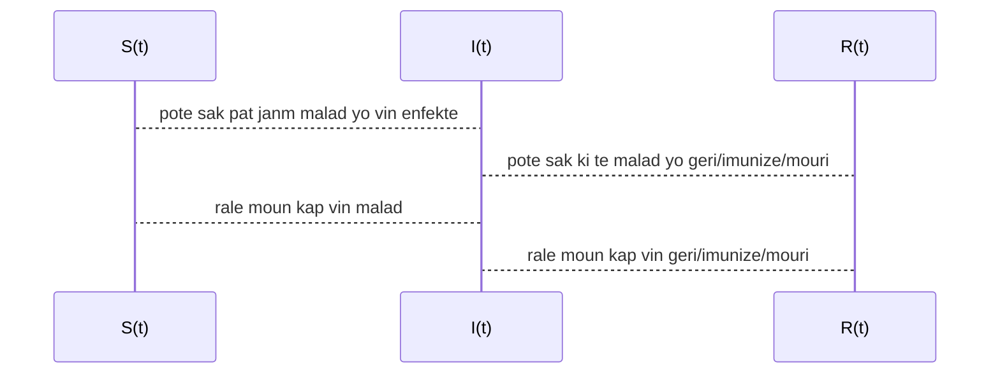

# Koub Enfeksyon nan model SIR yo

> Se pa tout sa nou ka **konte** ki *konte*, e sa pa tout sa ki *konte* ke nou ka **konte**.
>
> -- William Bruce Cameron (1963) "Informal Sociology: A Casual Introduction to Sociological Thinking"

Depi komansman kriz pandemik ki lye ak virus COVID-19 lan, gen anpil konsey ke pesonel medikal ak sante publik yo bay ki mansyone lide "plat koub la".  Koub sila a se, o mwen de manye konseptuel, solisyon yon ekwasyon diferansyel ki se reprezantasyon matematik yon fanmi de model epidemyolojik ki rele SIR.   

Jodi a nan **An Nou Pale Syans**, nou pral eseye entrodui e konprann kek aspe nann fondman matematik model sa yo.  Nap we kisa koub la modelize , e ki kote li soti.  Nap fe yon ti rale sou istwa model sa yo, e nap fe yon ti pase sou divesite natu matematik yo.  Pandan nap fe tout sa, nap eseye pran swen de mete an evidans limit model sa yo, san nou pa retire sou pouki nou dwe pran model sa yo oserye.

Yon denye bagay avan nou koumanse tout bon.  Pou mwen matematik se yon okazyon pou konvese.  Se pa yon dogm.  Se vre ke konvesasyon an gen anpil struktu, ki paret tre rijid.  Men se yon konvesayon li ye kanmenm.  Egal mwen ta vle nou li sa map ekri yo kom yon envitasyon, pou nou reflechi ansanm, ak matematik.

## Lide de baz de model SIR

Model SIR la, se yon model Byoloji Matematik, ki plase presizeman nan epidemyoloji matematik.  Lan domen sa a, pratik la se ke ou utilize de konsep matematik (ekwasyon diferansyel, prosesus stokastik) pou modelize de dinamik  de populasyon a echel makroskopik, pa egzanp kijan yon maladi ki kontajye propaje.

Pou yo fe sa, yo imajine ke populasyon an pataje an 3 group: 

- moun ki poko janm malad yo, $S(t)$ (an angle *susceptible*), le tan an rive $t$;
- moun ki gen maladi a, $I(t)$ sa vle di ki enfekte (an angle *infected*), le tan an rive $t$;
- epi moun nou pa bezwen konsidere anko lan sistem lan $R(t)$ (an angle *removed*), le tan an rive $t$.

Donk chak fonsyon sa yo di nou konbyen moun ki nan chak group le nou a tan $t$.  Lide prensipal se ke li posib pou nou **dekri chanjman lan chak group sa yo si nou annik itilize 3 group sa yo**:  

- chanjman lan group moun ki pat janm enfekte yo $S$, se pousantaj lan yo ki vin enfekte;
- chanjman lan group moun ki geri/imunize/mouri $R$, se pousantaj lan moun ki te enfekte yo ki geri/imunize/mouri ;
- chanjman lan group moun ki enfekte yo $I$, se diferans de lot chanjman yo.

Lide chanjman an nan matematik, sitou nan yon branch matematik ki rele analiz, se yon lide ki tre devlope e tre nuanse.  Yon vesyon de li se yon konsep ki rele derivasyon.  Derivasyon se yon operasyon matematik ki fet sou fonksyon.  Chanjman nou sot dekri yo, nou ka utilize yo pou nou ekri de **ekwasyon diferansyel**, i.e. de ekwasyon kote varyab la se yon fonksyon.  Solusyon se donk yon fonksyon, ou nan ka pa nou a 3 fonksyon, $\{S(t), I(t), R(t)\}$.  

### Yon ti-Model Analitik

Ekwasyon Diferansyel ou jan rekalsitran, egal yo pa toujou ka rezoud *alamen*.  Gen yon model ki **sanble** model SIR ke nou ka rezoud *alamen*, si ou gen eksperyans ak ekwasyon diferansyel:
$$
\begin{align}
s'(t) &= -\frac{r_0}{\tau}s(t)\\
i'(t) &=  \frac{r_0}{\tau}s(t) - \frac{1}{\tau} i(t)\\
r'(t) &= \frac{1}{\tau} i(t)
\end{align}
$$

- $\tau$: se yon paramet epidemyolojik ki depann de maladi a; se tan mwayen pou yon moun ki enfekte vin geri/imunize/mouri.  Pou COVID-19 se apepre [14 jou](https://annals.org/aim/fullarticle/2762808/incubation-period-coronavirus-disease-2019-covid-19-from-publicly-reported).
- [$r_0$](https://wwwnc.cdc.gov/eid/article/25/1/17-1901_article): se yon lot paramet epidemyolojik, ki mezire nivo kontajyon li.  Paramet sa depann de maladi a, men li depann tou de dispozisyon sante publik ki mete an plas.  Plis li eleve, plis maladi a kontajye.  Men mezi sanite tankou *distansyasyon sosyal*, *lave men*, *miz an karanten*, diminuye $r_0$.  Pou COVID-19 $r_0$ ant [1.5 e 3.5](https://labblog.uofmhealth.org/rounds/how-scientists-quantify-intensity-of-an-outbreak-like-covid-19).

Solusyon model sila ban nou premye vesyon **koub** enfekte yo:
$$
i(t) = s(0) \displaystyle \frac{r_0}{r_0-1}\left(e^{-t/\tau} - e^{-r_0t/\tau}\right),
$$
$s(0)$ se kantite moun ki inisyalman poko malad.  

Nou ka etidye fonksyon sa a. $i'(t)=0$ le $t^* = \frac{\tau \ln{r_0}}{r_0-1}$ e ek:
$$
i_{max} = i(t^*) = \frac{r_0}{r_0-1}\left[\left(\frac{1}{r_0}\right)^{\frac{1}{r_0-1}} - \left(\frac{1}{r_0}\right)^{\frac{r_0}{r_0-1}}\right].
$$

## Istwa Model SIR

## Model SIR Klasik lan

## Omojeneyite

