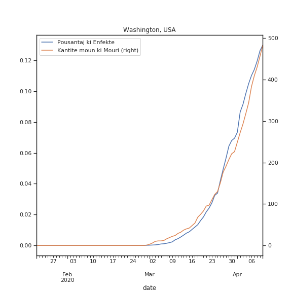
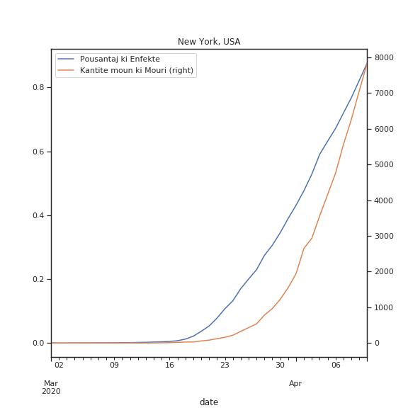
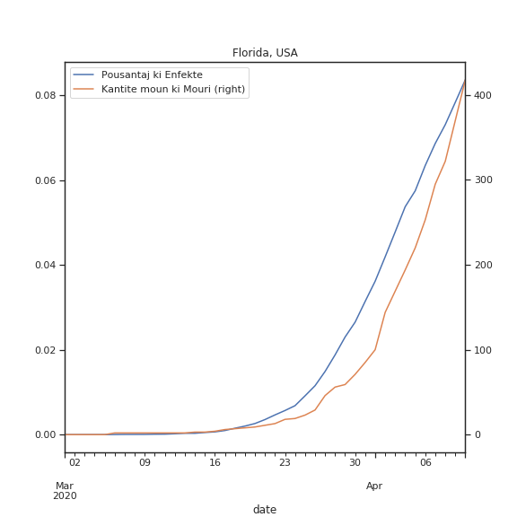

# Koub Enfeksyon nan model SIR yo

> Se pa tout sa nou ka **konte** ki *konte*, e sa pa tout sa ki *konte* ke nou ka **konte**.
>
> -- William Bruce Cameron (1963) *"Informal Sociology: A Casual Introduction to Sociological Thinking"*

Depi komansman kriz pandemik ki lye ak virus COVID-19 lan, gen anpil konsey ke pesonel medikal ak sante publik yo bay ki mansyone lide "plat koub la".  Koub sila a, o mwen de manye konseptuel, se solisyon yon ekwasyon diferansyel ki se reprezantasyon matematik yon fanmi de model epidemyolojik ki rele SIR.   

Jodi a nan **An Nou Pale Syans**, nou pral eseye entrodui e konprann kek aspe nann fondman matematik model sa yo.  Nap we kisa koub la modelize , e ki kote li soti.  Nap fe yon ti rale sou istwa model sa yo, e nap fe yon ti pase sou divesite natu matematik yo.  Pandan nap fe tout sa, nap eseye pran swen de mete an evidans limit model sa yo, san nou pa retire sou pouki nou dwe pran model sa yo oserye.

Yon denye bagay avan nou koumanse.  Pou mwen matematik se yon okazyon pou nou konvese.  Se pa yon dogm.  Se vre ke konvesasyon an gen anpil struktu, ki paret tre rijid.  Men se yon konvesayon li ye kanmenm, e rijidite a ede konvesasyon an koumanse; se pa yon babouket.  Apre konvesasyon an anklannche, pi bel kote li ka ale yo, se rout ki koumanse pa retire enpe lan restriksyon yo.  Egal mwen ta vle nou li sa map ekri yo kom yon envitasyon, pou nou reflechi ansanm, ak matematik.

## Epidemi, Pandemi, Andemi

## Lide de baz model SIR yo
#### Poukisa nou utilize yon model

Anvan nou pale de lide de baz model SIR yo, an nou etabli poukisa nou ka enterese nan model matematik sa yo.  An jeneral, yon model se yon reprezantasyon yon reyalite.  Pa egzanp, yon achitek ka fe pou yon kliyan, yon model de batiman ke kliyan te mande konpani konstriksyon an fe.  Model lan pemet:

- kliyan an gen yon ase bon reprezantasyon vizuyel de batiman an;
- kliyan an diskite ak konpani an sou seten aspe de batiman; 
- kliyan konprann kijan de bagay li vle ajoute ou byne retire lan plan kay lan ap afekte konstriksyon an;

tout sa anvan ankenn beton koule.  Li enpotan pou nou remake ke model ke achitek la fe a, pa pran an konsiderasyon seten bagay ki pa nesese, tankou bri lan lari toupre batiman an, ou byen jan van vante kote batiman an ap ye a.  Nou remake tou ke sa pa deranje diskisyon yo, ke model lan de lwen pi piti ke vre batiman an.  Toutfwa, fok nou soulve tou ke model achitek lan, maket la, pa ka enfome ou rasure kliyan an sou rezistans parasismik ou siklonik batiman an.  Gen de aspe krusyal de sistem wap modelize a ke model lan inyore, pou ka konprann de lot aspe de sistem lan.

> Sonje ke tout model erone, kesyon pratik lan se, ki kantite erone fo yo erone pou yo sispann util.
>
> -- George Box (1987) *"Empirical Model-Building and Response Surface"*

| premye eta afekte  | lot kote           |
| ------------------ | ------------------ |
|  |  |
|  |  |

Nou ta renmen ka konprann kijan koub an ble yo evoluye.

#### Lide de baz lan

Model SIR la, se yon model Byoloji Matematik, ki plase presizeman nan epidemyoloji matematik.  [Epidemyoloji](https://en.wikipedia.org/wiki/Epidemiology) se pati lasyans ki etudye e analize, ki moun, ki le, ki kote, e kisa ki detemine kouman yon maladi evolue nan yon populasyon. Lan epidemyoloji matematik, pratik la se ke ou utilize de konsep matematik (ekwasyon diferansyel, prosesus stokastik) pou modelize de dinamik  de populasyon a echel makroskopik, pa egzanp kijan yon maladi ki kontajye propaje.

Pou yo fe sa, yo imajine ke populasyon an pataje an 3 group: 

- moun ki poko janm malad yo, $S(t)$ (an angle *susceptible*), le tan an rive $t$;
- moun ki gen maladi a, $I(t)$ sa vle di ki enfekte (an angle *infected*), le tan an rive $t$;
- epi moun nou pa bezwen konsidere anko lan sistem lan $R(t)$ (an angle *removed*), le tan an rive $t$.

Donk chak fonsyon sa yo di nou konbyen moun ki nan chak group le nou a tan $t$.  Lide prensipal se ke li posib pou nou **dekri chanjman lan chak group sa yo si nou annik itilize 3 group sa yo**:  

- chanjman lan group moun ki pat janm enfekte yo $S$, se pousantaj lan yo ki vin enfekte;
- chanjman lan group moun ki geri/imunize/mouri $R$, se pousantaj lan moun ki te enfekte yo ki geri/imunize/mouri ;
- chanjman lan group moun ki enfekte yo $I$, se diferans de lot chanjman yo.

Lide chanjman an nan matematik, sitou nan yon branch matematik ki rele analiz, se yon lide ki tre devlope e tre nuanse.  Yon vesyon de li se yon konsep ki rele derivasyon.  Derivasyon se yon operasyon matematik ki fet sou fonksyon.  Chanjman nou sot dekri yo, nou ka utilize yo pou nou ekri de [**ekwasyon diferansyel**](https://en.wikipedia.org/wiki/Differential_equation), i.e. de ekwasyon kote varyab la se yon fonksyon.  Solusyon se donk yon fonksyon, ou nan ka pa nou a 3 fonksyon, $\{S(t), I(t), R(t)\}$.  

### Yon ti-Model Analitik, pou entroduyi $\tau$ ak $r_0$

An nou koumanse tou piti.  Ekwasyon Diferansyel ou jan rekalsitran, egal yo pa toujou ka rezoud *alamen*.  Gen yon model ki **sanble** model SIR ke nou ka rezoud *alamen*, si ou gen eksperyans ak ekwasyon diferansyel.  Model lan se yon model pou desentegrasyon radyoaktif 2 patikul, men nou pral adapte li pou nou kom aproksimasyon senp model SIR yo:
$$
\begin{align}
s'(t) &= -\frac{r_0}{\tau}s(t)\\
i'(t) &=  \frac{r_0}{\tau}s(t) - \frac{1}{\tau} i(t)\\
r'(t) &= \frac{1}{\tau} i(t)
\end{align}
$$

- $\tau$: se yon paramet epidemyolojik ki depann de maladi a; se tan mwayen pou yon moun ki enfekte vin geri/imunize/mouri.  Pou COVID-19 se apepre [14 jou](https://annals.org/aim/fullarticle/2762808/incubation-period-coronavirus-disease-2019-covid-19-from-publicly-reported).
- [$r_0$](https://wwwnc.cdc.gov/eid/article/25/1/17-1901_article): se yon lot paramet epidemyolojik, ki mezire nivo kontajyon li.  Paramet sa depann de maladi a, men li depann tou de dispozisyon sante publik ki mete an plas.  Plis li eleve, plis maladi a kontajye.  Men mezi sanite tankou *distansyasyon sosyal*, *lave men*, *miz an karanten*, diminuye $r_0$.  Pou COVID-19 $r_0$ ant [1.5 e 3.5](https://labblog.uofmhealth.org/rounds/how-scientists-quantify-intensity-of-an-outbreak-like-covid-19).

Solusyon model sila ban nou premye vesyon **koub** enfekte yo:
$$
i(t) = s(0) \displaystyle \frac{r_0}{r_0-1}\left(e^{-t/\tau} - e^{-r_0t/\tau}\right),
$$
$s(0)$ se kantite moun ki inisyalman poko malad.  

| $r_0=3.5$                      | $r_0=1.5$                      |
| ------------------------------ | ------------------------------ |
|  |  |

Nou itilize yon ti kalkul pou nou etidye fonksyon sa a:
$$
i'(t)=0, \quad \textrm{le} \quad t^* = \frac{\tau \ln{r_0}}{r_0-1}
\\ \textrm{donk}\\
i_{max} = i(t^*) = \frac{r_0}{r_0-1}\left[\left(\frac{1}{r_0}\right)^{\frac{1}{r_0-1}} - 
\left(\frac{1}{r_0}\right)^{\frac{r_0}{r_0-1}}\right].
$$

| Maksimom enfekte an fonksyon de $r$                          |
| ------------------------------------------------------------ |
|  |

Nou ka **plat koub la** si nou pran mezi tankou distans sosyal, ki gen kom konsekans reduyi $r0$, ki li menm reduyi maksimom enfekte yo.  

## Model SIR Standar lan

> Tout bagay dwe osi senp ke posib, men pa pi senp ke sa
>
> -- Albert Einstein (atribuye 1962) *TIME Magazine*

Koulye a ke nou gen yon lide de sa koub la ye, e sa li vle di.  An nou rantre, nou ka al pi lwen ke ti model aproksimatif ke nou sot we a.  Ti model nou a te **tro senp**.  Pi gro defo li genyen se ke li sugjere ke chanjman lan moun ki poko gen maladi a, pa depann de nivo enfeksyon an nan populasyon an.

#### Istwa Modelizasyon Epidemi

Modelizasyon matematik de epidemi gen yon ti istwa ase long.  Depi an 1760, yon matematisyen Suyis, [Daniel Bernoulli](https://en.wikipedia.org/wiki/Daniel_Bernoulli), te utilize modelizasyon yo, pou li konprann merit vaksinasyon nan kad motalite ki lye ak epidemi varyol.  

Youn lan premye model matematik pou epidemi, se te yon model ke statistisyen [Lowell Reed](https://en.wikipedia.org/wiki/Lowell_Reed) ak epidemyologis [Wade Hampton Frost](https://en.wikipedia.org/wiki/Wade_Hampton_Frost) te propose an 1928 nan de klas yo tap anseye Johns Hopkins University.  Model sa te baze sou de konsep matematik ke nou jwenn nan probabilite ke yo rele de [**prosesus stokastik**](https://en.wikipedia.org/wiki/Stochastic_process), presizeman Reed ak Frost fomule model yo a an te ke yon prosesus stokastik ki rele yon [chen Markov](https://en.wikipedia.org/wiki/Markov_chain).  Model [Reed-Frost](https://en.wikipedia.org/wiki/Reed-Frost_model) lan pati de lide de baz lan, separe populasyon an group $\{S(t), I(t), R(t)\}$, men koulye a pa egzanp, model la di ou egzakteman konbyen moun kap enfekte $I(t)$ a $t$, men li di ou de preferans probabilite ke kantite moun lan se $0, 1, 2, 3 , 4 \ldots$, $p_0, p_1, p_2, p_3, p_4, \ldots$; le fet ke prosesus lan se yon chen Markov presize ke pa egzanp $p_k$ se yon fonksyon de $S(t-1), I(t-1), R(t-1)$.   A nou di ke $q$ se probabilite pou pa pran maladi a le ou kontre ak yon moun ki enfekte,  an probabilite nou ekri model Reed-Frost lan:
$$
\mathbb{P}\left\{I(t) = k | S(t-1), I(t-1), R(t-1)\right\} = {S(t-1) \choose k} \left(1-q^{I(t-1)}\right)^{k}\left(q^{I(t-1)}\right)^{S(t-1)-k}.
$$
Model sila enteresan paske li pi fidel a vre dinamik yon epidemi.  Chak moun ki gen maladi a, le yo pre yon moun ki poko janm gen maladi a, yo gen yon chans pou yo enfekte moun sila.  Plis enteraksyon long, plis yo te pre, plis moun malad la touse, plis chans lan monte ve yon setitud, men se kanmenm yon chans.  Model ki baze sou ekwasyon diferansyel yo, model **deteminis** yo, rezume enfomasyon sila, e dufet pedi lan fidelite yo.  Men sa model Reed-Frost akeri lan fidelite li peye li ak difikulte.  An jeneral an matematik, li pi difisil pou konprann yon model deteminis, ke yon model **stokastik**; donk malgre model stokastik lan gendwa pi rich e subtil, ou gen tandans konprann e dekouvri plus nuans avek model deteminis yo.

#### Model SIR Standar lan

Donk model epidemyoloji SIR standar lan se yon model ke biochimis [Kermack](https://en.wikipedia.org/wiki/William_Ogilvy_Kermack) ak epidemyologis [McKendrick](https://en.wikipedia.org/wiki/Anderson_Gray_McKendrick) entroduyi an 1927.  Se yon model ekwasyon diferansyel, donk deteminis.  Li pati de lide de baz lan, men kontreman a model desentegrasyon 2 patikul radyoaktif lan, li entroduyi ke chanjman lan moun ki poko gen maladi a, **depann** de nivo enfeksyon an nan populasyon an.  Ekwasyon diferansyel lan se:
$$
\begin{align}
S'(t) &= -\frac{r_0}{\tau}I(t)S(t)\\
I'(t) &=  \frac{r_0}{\tau}I(t)S(t) - \frac{1}{\tau} I(t)\\
R'(t) &= \frac{1}{\tau} I(t)
\end{align}
$$
Jan nou te di lan koumansman an, ekwasyon diferansyel yo rekalsitran, egal nou paka rezoud ekwasyon sila *alamen*.  Presizeman, ekwasyon sila rekalsitran paske li pa lineye, kontreman a ekwasyon radyoaktivite nou a.  Le yon ekwasyon diferansyel lineye, nou ka utilize struktu aljebrik sila pou nou rezoud li *alamen*.  Domajman, model Kermack-McKendrick lan non-lineye.  

Toufwa, nou ka itilize yon lot aproch.  Nou itilize yon aproch **numerik**, kote nou itilize yon algoritm ke nou programe yon odinate pou egzekite li.  Teknik numerik nou utilize pou nou jwenn solusyon model Kermack-McKendrick lan se yon algorithm ki rele [metod Runge-Kutta](https://en.wikipedia.org/wiki/Runge-Kutta_methods) ke 2 matematisyen Alman [Runge](https://en.wikipedia.org/wiki/Carl_David_Tolm%C3%A9_Runge) ak [Kutta](https://en.wikipedia.org/wiki/Martin_Kutta) devlope nan debu 20tyem syek lan.

Youn lan premye bagay mwen vle aksantuye sou li, se ke, solusyon ekwasyon Kermack-McKendrick yo pa menm ak solusyon model radyoaktivite yo:

| $\tau = 14, R_0 = 3.5$   | $\tau = 14, R_0 = 1.5$   |
| ------------------------ | ------------------------ |
|  |  |
|  |  |

- Tou de montre tandans kwasans rapid lan le  gen ankenn mezi sante publik ki pran, sepandan model radyoaktivite a montre ke jiska 60% de populasyon an enfekte aloske model SIR ki pi fidel lan montre pik enfeksyon an rive mwens ke 40%.
- Pi enpotan toujou, model SIR montre efikasite potansyel mezi sante publik yo, lan jan koub plat lan chanje.

| Model SIR Kermack-McKendrick: Plat Koub La! |
| ------------------------------------------- |
|                       |

## Omojeneyite e lot limit model Kermack-McKermick lan